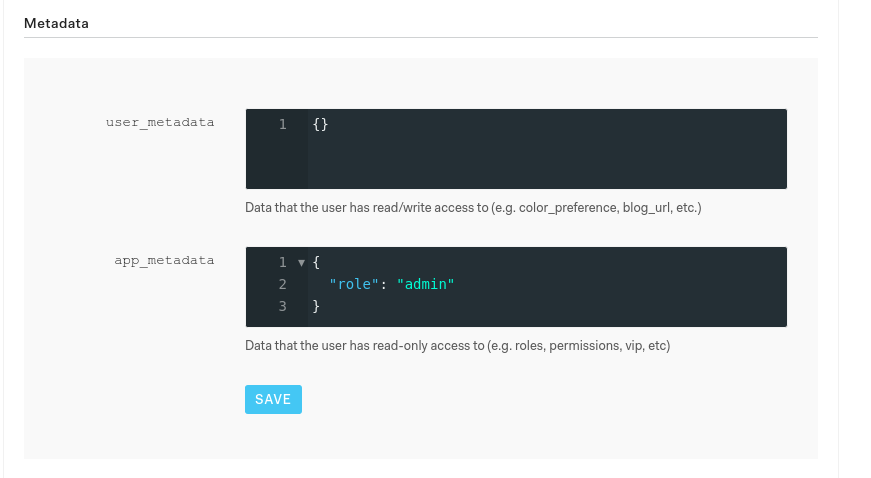
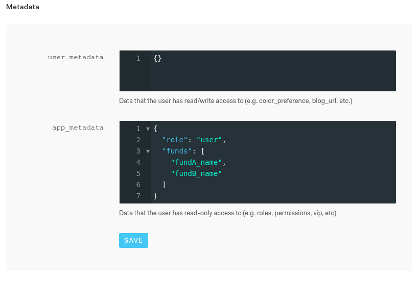

# Schema des données brutes

NX Digital préférera la donnée la plus brute possible, directement telle que transmise par un fournisseur ou un valorisateur et telle qu’exportée par un système tierce.
Pour assurer une qualité optimale, il est nécessaire que l’ensemble de la chaîne de traitement soit automatisé et ne comporte pas de saisie manuelle.

Les données sont à transmettre au format ‘.csv’.

## Référentiels

Nous rassemblons toutes les données référentielles dans un document excel que nous appelons “nx-pack”. Ce document vous permet d’avoir la main sur les données référentielles de vos fonds et des valeurs, de gérer leurs traductions, tout en centralisant l’information. C’est l’unique source de vérité du référentiel de l’application digitale. La flexibilité du nx-pack vous donne un contrôle précis et la liberté d’actualiser facilement les informations référentielles de l’application.

Ce fichier nx-pack.xlsx est constitué de 5 onglets:
- funds_referential
- assets_referential
- management_comment
- translation

Un exemple de fichier nx-pack.xlsx vous sera fourni en début de projet.

### Funds referential

L'onglet 'funds_referential' contient le référentiel des fonds et de leurs parts.

Les informations sont par exemple le nom du fonds, sa catégorie, son id, les gérants, l’axe de gestion, le nom de la part, son ISIN, sa catégorie, sa devise, etc…
Les colonnes de cet onglet sont gérées dynamiquement, et peuvent être modifiée au besoin du client.

### Assets referential


L’onglet 'asset_referential' contient le référentiel valeurs. Ce sont les données qui nous permettent d'agréger par catégories dans l'application : pays, classe d'actif, horizon de liquidité, devise, secteur, type, notation, industrie etc.
Les colonnes de cet onglet sont flexibles. Peuvent apparaître autant de colonnes que souhaité. Il faut cependant que les colonnes ISIN et libellé de l'instrument apparaissent.

### Management comment

Cet onglet contient les commentaires de gestion, traduits et historisé
Cet onglet est composé des colonnes : 'Date', 'Fund ID' et d'autant de colonne qu'on a de langues. La colonne 'Date' doit avoir comme format: mois-année (exemple: Jan-19).

### Managers

Cet onglet contient les informations de présentation des gérants, traduites dans chaque langue.

### Translation

L’onglet ‘translation’ accueille les traductions de tous les champs du référentiel qui ont besoin d’être traduits.

Les onglets funds_referential et assets_referential sont typiquement rempli dans une unique langue. C’est dans cet onglet que vous pourrez renseigner les traductions dont vous avez besoin.
Par exemple, si vous souhaitez traduire une catégorie Pays, il suffit de référencer les traductions de cette catégorie dans cet onglet. Ceci permet de centraliser les informations dans un seul document.


## Données comptables (Gestion Collective)
L’application NX Digital est basée sur les données comptables. Vous devrez transmettre à NX Digital l’ensemble des données d’inventaires valorisés, de mouvements, de souscription rachats, de pnl ligne-à-ligne, ainsi que les séries temporelles de la valorisation de chacune des parts, du nombre de parts, et des dividendes. Selon les valorisateurs, ces données vont se trouver dans différents rapports qui sont détaillés ci-dessous.

### BPSS
Fichiers "Nav Pack" quotidiens bruts pour tous les fonds, au format excel
### Caceis
Les rapports quotidiens pour toutes les parts de fonds, au format ‘.csv’:
- HISINV.csv
- ESPVL.csv
- JOUROP.csv
- JUSCOM.csv
- FLUVAL2.csv
- JOURSR.csv

## Données de Portefeuilles (Gestion Privée)

### Données d’allocations valorisées
Le data model attendu correspond à un fichier .csv pour chaque portefeuille, avec les champs suivants :

date, isin, price, quantity, pnl, pnl_realized, pnl_latent, pnl_wallet_shares (P&L per day per line per ‘share’ of the portfolio).
Ce fichier .csv sera intitulé allocation.csv

### Données de performance
Le data model attendu correspond à un fichier .csv pour chaque portefeuille, avec les champs suivants : date, aum, pnl, benchmark, nav, quantity.

Ce fichier .csv sera intitulé performance.csv.

### Données de transaction
Le data model attendu correspond à un fichier .csv pour chaque portefeuille, avec les champs suivants : date_start, date_end, isin, price_start, price_end, quantity, transaction_fee_start, transaction_fee_end

Ce fichier .csv sera intitulé trades.csv

## Données benchmark

### Niveaux des indices
Les niveaux des indices doivent nous être transmis avec les valeurs liquidatives des parts de fonds, au sein d’un fichier .csv sous forme d’une série temporelle.

### Composition des indices
Pour que nous effectuions les attributions de performance, vous devrez nous fournir les compositions des indices ou benchmarks que vous utilisez. Ces compositions doivent faire apparaître le détail du portefeuille, avec pour chaque ligne l’isin (ou I.D.), le poids, le rendement total ajusté de la ligne depuis le dernier état.

## Meta données
Les autres indicateurs, et notamment les données extra-financières, nous sont communiqués via un fichier .csv dédié contenant un nombre de séries temporelles arbitraire.

# Protocole de transfert

Le transfert de données s'effectue sur un SFTP hébergé par NX Digital. C'est un FTP sécurisé qui nécessite une clé SSH pour se connecter.

C'est à partir des données transmises sur le SFTP que nous mettons l'application NX Digital à jour. Ceci se fait automatiquement à heure prédéfinie, mais peut aussi se faire de manière instantanée dès qu'un fichier est modifié sur le SFTP.

## Création d’une Clef d’Encryption

Afin de pouvoir vous connecter au SFTP, il faut nous donner votre clé publique. Demandez à votre service d'en créer une si vous n'en avez pas. Vous trouverez également ici un tutoriel pour en créer une vous-même: [https://help.github.com/articles/generating-a-new-ssh-key-and-adding-it-to-the-ssh-agent/](https://help.github.com/articles/generating-a-new-ssh-key-and-adding-it-to-the-ssh-agent/)

## Connexion
Une fois que la clé publique nous a été transmise, vous pourrez vous connecter au serveur depuis un utilitaire bash avec la commande suivante:

```
sftp -i ~/.ssh/{CLE_PRIVEE} {NOM_DE_PROJET}@surface.100m.io:raw
```

où CLE_PRIVEE est votre fichier de clé privée, et NOM_DE_PROJET le nom que nous avons donné au projet (communiqué par email).

Vous pouvez également vous connecter en utilisant un utilitaire de gestion SFTP type FileZilla.

Une fois connecté en SFTP, vous n'avez les droits d'écriture que sur le dossier raw ou app.

# Gestion des utilisateurs
## Auth0
Pour gérer les utilisateurs de l'application, connectez vous à l'interface Auth0 avec les identifiants qui vous ont été fournis.  
Lien: [Interface Auth0](https://auth0.com/)

## Interface Users
Lien: [Section User](https://manage.auth0.com/#/users)

### Ajout d'utilisateur
 - Cliquer sur 
 - Renseigner Email utilisateur et Password
 - Cliquer sur save

### Type d'utilisateurs
Il y a 3 types(roles) d'utilisateurs

#### Role par défaut
Utilisateur qui a accès à tous les fonds, mais pas aux interfaces admin

#### Role admin
Utilisateur qui a accès à tous les fonds et aux interfaces admin
Pour donner le role admin à un utilisateur:
 - Cliquer le nom de l'utilisateur pour ouvrir l'écran User Details
 - Dans cet écran écrire "role": "admin" dans app_metadata  
Cf. image:


#### Role user
Utilisateur qui a accès à un nombre restreint de fonds.
Pour donner le role user à un utilisateur:
 - Cliquer le nom de l'utilisateur pour ouvrir l'écran User Details
 - Dans cet écran écrire "role": "user" dans app_metadata
 - écrire "funds": [ clés des fonds dont il a accès ]  
Cf. image:

